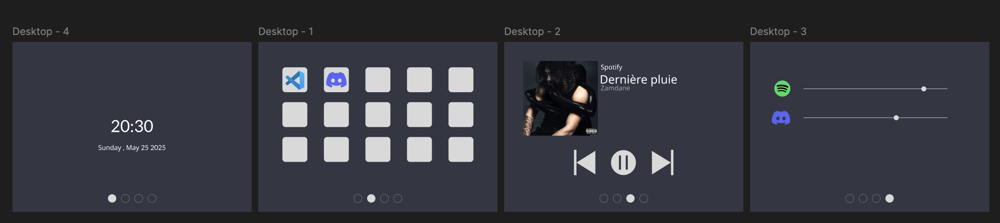

# PiDeck

## Why PiDeck
PiDeck is a DIY (Do It Yourself) computer hub.  
Running on a Raspberry Pi with a touchscreen,  
you will be able to launch applications, manage the music you're listening to,
and control your system audio.



## Installation

```
make
./pideck
```

## Contributing
This project is open-source and developed with the community.  
Feel free to submit a pull request. Every contributor will be credited.

## Credits

@shyybi